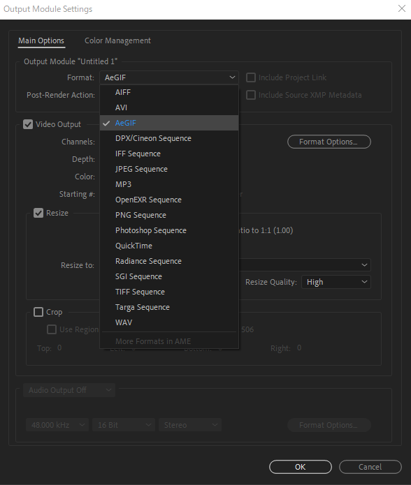
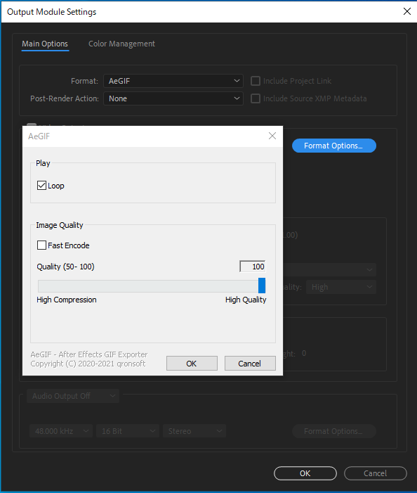

# AeGIF - After Effects GIF Export plugin

## Installation
- Download the plugin file [Here](
https://github.com/qronsoft/aegif/releases/download/v0.0.1/aegif.aex
).
- Put the plugin file in your After Effects Plug-ins folder.
  - e.g) `C:\Program Files\Adobe\Adobe After Effects 2020\Support Files\Plug-ins`

## How to Use
1. Add an composition to After Effects render queue.
1. Select **"AeGIF"** format in Output Module Settings.

1. Open the options dialog and change the encode settings if necessary.

1.  Start to render!
